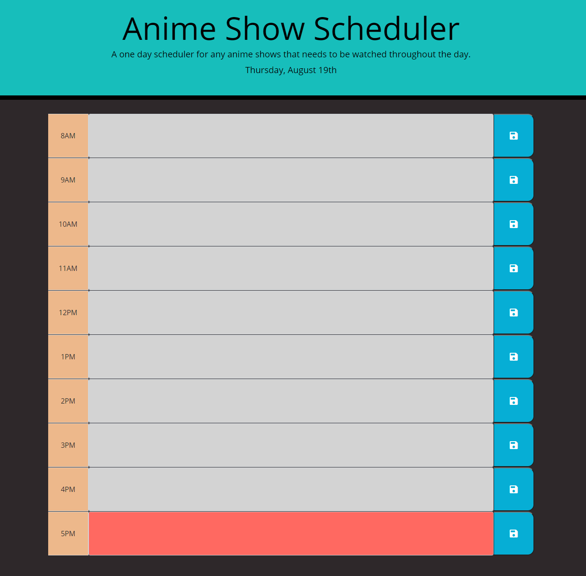

# calendar

A basic canlendar for upcoming anime shows that needs to be watched. 
The user will have the ability to add in what is needed to be watched on the certain time  in the text area given and also save it on their local storage.
The date on top will represent the current day it is in the present.
Depending on what time it is, the user will notice that the 'gray' areas are times that have been passed, 'red' areas states the current time and the 'green' area are upcoming future time.

Link: https://polyca123.github.io/calendar/

